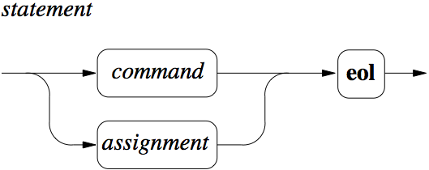
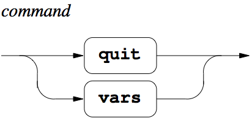
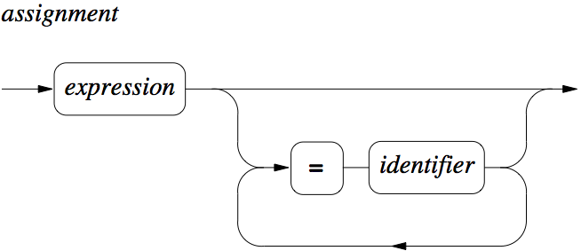
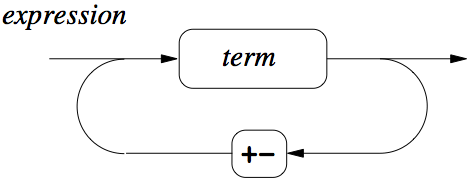
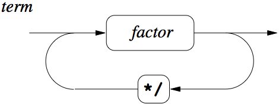
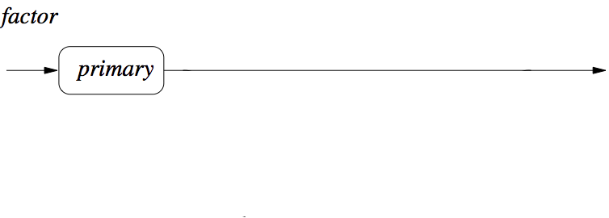
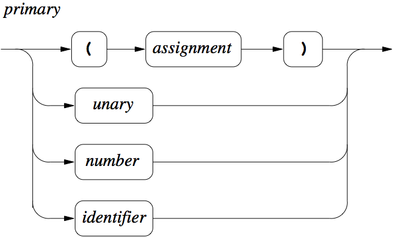
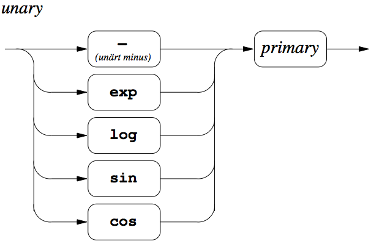
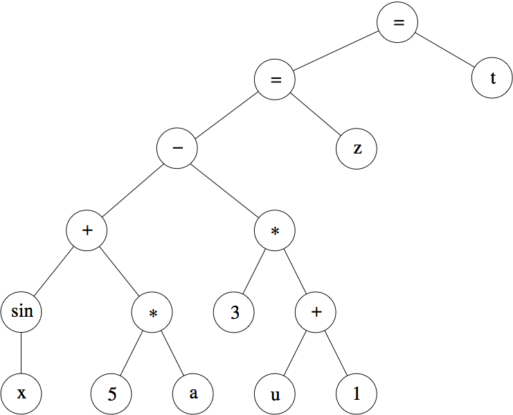
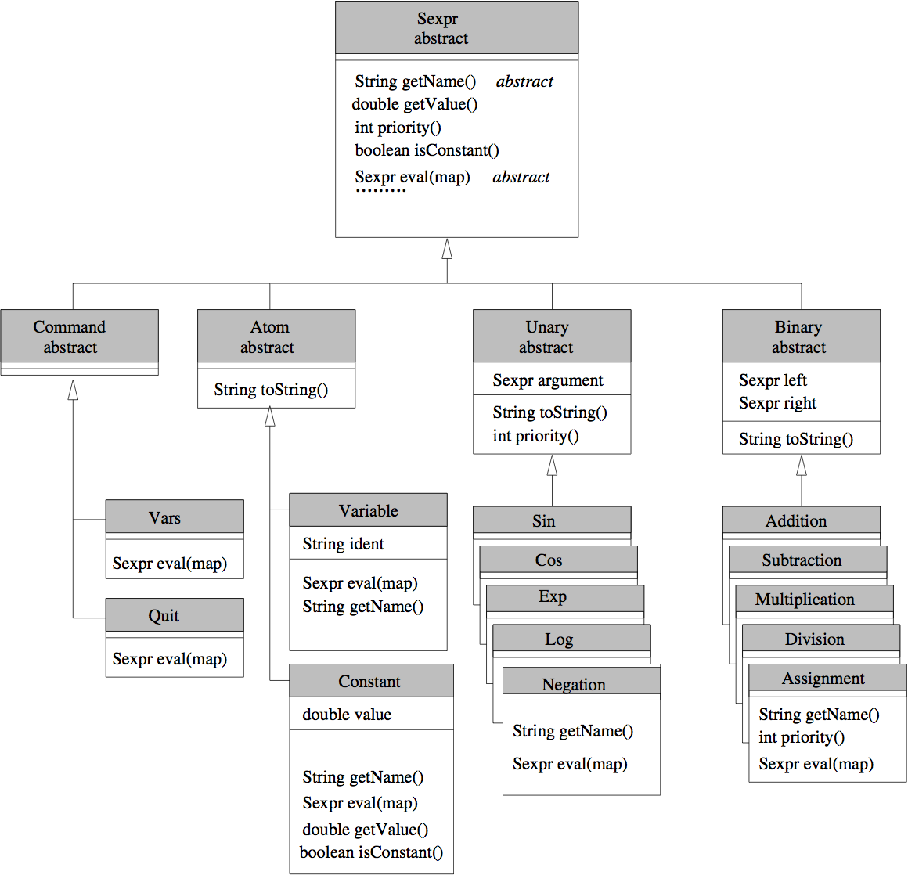

#Symbolisk kalkylator

Uppgiften går ut på att skriva ett program som läser in och
beräknar enkla aritmetiska uttryck.

Som en sido-effekt av detta får du arbeta med objektorientering
med klasshierarkier, arv och dynamisk bindning samt dynamiska
strukturer, undantag, samlingar och recursive descent.

**Notera hur delar av denna uppgift knyter an till automatateorin!**

##Programfunktion

Först exemplifierar vi den rent numeriska aritmetiken. Så här
kommer en körning av det färdiga programmet se ut. `?` är en
prompt i programmet där användaren skriver in uttryck och
resultatet skrivs ut på en ny rad efteråt. Notera vissa mindre
vanliga syntaktiska tilltag som variabeltilldelning med
variabelnamn till höger, och multipel tilldelning. Variabler
deklareras inte utan skapas när de används första gången. Det som
står inom hakparenteser är kommentarer till dig som läser det här.

```
foo> java Calculator
Welcome to the symbolic calculator!
? 2*(5-2)
6.0           [Alla numeriska beräkningar sker i flyttalsaritmetik (double)]

? 1/(2+8) = a [Spara värden i variabler. Tilldelningen går åt höger]
0.1           [Värdet av en tilldelning är det tilldelade värdet]

? 2 = x = y   [Multipla tilldelningar]
2.0

? (x+y=z) - (z-1)*(1=x) [Tilldelningar i uttryck. Evaluering från vänster till höger.]
1.0

? -sin(exp(a*a*10)) [Elementära funktioner]
-0.8935409432921488

? ans [En fördefinierad variabel som alltid innehåller värdet av senast beräknade uttryck]
-0.8935409432921488

? -ans+2 [Variabeln ans kan användas i uttryck som andra variabler]
2.8935409432921488

? - - -x
-1.0
```

```
? vars  [Kommando för att se vilka variabler som finns]
2 {ans=1.0, a=0.1, x=1.0, y=2.0, z=4.0}

? 3**5 ++ x [Felhantering]
*** Syntax Error: Unexpected: *

? foo(x+y)
*** Syntax Error: Unexpected: (

? 1/0 [Vissa fel kan överlåtas åt Java för hantering]
Infinity

?
```

## Symboliska operationer

Som nämnts skall kalkylatorn kunna hantera uttryck *symboliskt*. Exempel:

```
foo> java Calculator
Welcome to the symbolic calculator
? b [Odefinierade variabler har sig själva som värde]
b

? 1 = a
1.0

? a + b [En beräkning resulterar i ett uttryck]
1.0 + b


? b + a = c [Värden kan vara uttryck]
b + 1.0

? 2 = b   [Även om b tilldelas ett värde så påverkar detta inte uttryck innehållande b som redan definierats]
2.0

? c [Evaluering görs endast en gång -- värdet evalueras inte!]
b + 1.0

? 2*x = y
2.0*x
```

## Ytterligare exempel

| Indata      | Värde   | Kommentar
|-------------|---------|-----------
| `3=x      ` | `3    ` | Värdet av tilldelningen är `3`
| `x+y      ` | `3+y  ` | Om en symbol tilldelats ett värde så används värdet vid evalueringen
| `z+2=y    ` | `z+2  ` |
| `3=z      ` | `3    ` |
| `y        ` | `z+2  ` | Symboler evalueras bara en gång (annars skulle värdet bli `5`)
| `y=f      ` | `z+2  ` | Som sagt, endast en gång
| `f+z*2    ` | `z+2+6` | Symbolerna evalueras EN gång men...
| `f+z*2    ` | `z+8  ` | ...skulle kanske kunna göra en bättre förenkling! Dock svårt!
| `z + x = g` | `6    ` | `g` får värdet `6`
| `g        ` | `6    ` | ...men man kanske ville ha värdet `z + x`!
| `f        ` | `z+2  ` | Definierat ovan.
| `z        ` | `3    ` |
| `(f + z*z)` | `z+2+9` |

## Syntaxdiagram

Indata till programmet beståer av satser (*statement*) skrivna en
per rad. Syntaxen definieras av nedanstående diagram.
**Observera** Tidigare innehöll denna uppgift även
deriveringsoperationer vilket kan ses i syntaxdiagrammet för
*factor*. Nu kan man enkelt unifiera *factor* och *primary*.
(**eol** står för "end of line".)
















##Programdesign

###Intern representation av uttryck

Programmet skall läsa uttrycken och bygga upp en
internrepresentation som lämpar sig för evaluering. Ni skall
använda en **trädstruktur** där operatorer och funktioner lagras i
de interna noderna och konstanter och variabler i löven.

Det matematiska uttrycket

```
sin x + 5*a - 3*(u+1) = z = t
```

skall alltså representeras av trädet nedan.



Gemensamt för alla noder är (bl.a.) att de skall kunna *evalueras*
men evaluering beter sig olika beroende på vad det är för typ av
nod (*konstant*, *variabel*, *addition*, ...).

Eftersom noderna ska kunna vara av olika typer (operatorer,
funktioner, variabler, konstanter, ...) är det lämpligt att
implementera dem i en klasshierarki med en generell basklass som
skulle kunna kallas `SymbolicExpression`. Av layout-skäl
kan det dock vara bra att använda ett kortare namn som
`Sexpr` eftersom detta namn kommer att vara oerhört
frekvent i koden.

Gör egna klasser för varje operation och funktion
(`Assignment`, `Addition`, `Subtraction`,
`Sin`, ...) samt en klass för variabler och en för
konstanter.

Det finns tre tydligt urskiljbara grupper av noder: de med
*två* operander (*binära operatorer*), de med
*en* en operand (*funktioner*, *unärt minus*)
och de utan operander (*konstanter*, *variabler*).
Det är inte bara antalet operander som är gemensamt för varje
grupp utan även vissa metoder. Sålunda kan bl.a.
`toString`-metoderna skrivas på samma sätt t.ex. för alla
binära operatorer.

Således skall man samla binära operatorer under klassen `Binary`
och unära operatorer (inklusive funktioner) under klassen `Unary`.
Av "symmetriskäl" är det lämpligt att samla konstanter och
variabler under klassen `Atom` även om det nog inte finns så
mycket som kan utnyttjas gemensamt mellan dessa två grupper.

Det leder till följande design (ytterligare metoder kommer behöva
tillföras):




**OBS!** Konstruktorer är inte angivna i figuren.

Det är lämpligt att placera `Sexpr` och dess subklasser ett eget
paket (`symbolic`). Basklassen `Sexpr` bör således ha följande
utseende.

```
package symbolic;
import ...;

public abstract class Sexpr{

   public Sexpr() {
   }
   ...
}
```

Ett exempel på en klass på mellannivån i hierarkin är `Unary`:

```
package symbolic;

public abstract class Unary extends Sexpr {

   private Sexpr argument; // bör denna vara private?

   public Unary(Sexpr a){
      argument = a;
   }

   public String toString() {...}
   public priority() {...}
}
```

###Hur bygger man internstrukturen?

Uttryck byggs av en parser som implementerar *recursive descent*.
liksom den från
[screencasten](../../../../extramaterial/screencasts) i
ämnet. Den modifieras nu så att varje metod som förut returnerade
ett tal (en `double`) nu returnerar en *referens till en skapad
nod* (alltså en `Sexpr`). Du hittar originalkoden på samma ställe
som screencasten.

Exempel: Parsermetoden  `expression` får följande uteseende (med
en `StreamTokenizer st`):

```
   public Sexpr expression() {
      Sexpr sum = term();
      while (st.ttype=='+' || st.ttype=='-') {
         int operation = st.ttype;
         st.nextToken();
         if (operation=='+')
             sum = new Addition(sum, term());
         else
             sum = new Subtraction(sum, term());
      }
      return sum;
   }
```

Där man tidigare utförde en addition eller en subtraktion skapar
man nu en additionsnod respektive en subtraktionsnod.

###Hur gör programmet för att skriva ut uttryck?

Som vanligt använder man `toString()`-metoder för att skapa en
textrepresentation av de lagrade uttrycken. Dessa metoder gör i
princip en inordertraversering av trädet. Ett problem är att i
trädet är evalueringsordningen given av strukturen men i den
externa bestäms den av prioriteter och parenteser. Således måste
`toString()`-metoderna, vid behov, sätta ut parenteser för att
uttrycken skall bli korrekta. Man kan göra det lätt för sig genom
att *alltid* sätta ut parenteser men det blir inte så vackert.

Eftersom parenteshanteringen kan göras på samma sätt för alla
unära respektive alla binära operatorer så placeras
`toString`-metoderna i klasserna `Unary` respektive `Binary`.
Själva operatornamnet erhålles av `getName()`.

Så här ser klassen `Unary` ut med en naiv implementation
(d.v.s. en som sätter ut parenteser var sig det behövs eller ej)
av `toString()`:

```
   public abstract class Unary extends Sexpr {
      Sexpr argument;

      public String toString() {
         return getName() + "(" + argument.toString() + ")";
      }
      ...
   }
```

###Variabellistan

Eftersom värden nu är symboliska och inte numeriska måste
värdetypen i variabellistan (hashtabellen) vara av `Sexpr`:

```
   Map<String,Sexpr> variables = new HashMap<String,Sexpr>();
```

Observera att variabellistan inte alls skall användas i parsern
utan *evalueringsmetoderna*!


###Huvuditeration

Följande struktur i `main` (eller annan drivmetod) är lämplig (men
bör utökas för att hantera vissa specialfall som quit, och
eventuellt även andra ändringar):

```
    Parser p = new Parser();
    Map<String,Sexpr> variables = new HashMap<String,Sexpr>();

    while (true)
       try {
          System.out.print("? ");
          Sexpr e = p.statement();
          System.out.println("Inläst uttryck: " + e)  // För kontroll
          System.out.println(e.eval(variables));
       } catch (...) {
       ...
```

(Kräver lite eftertanke om vad kommandonas `toString`- och
`eval`-metoder skall returnera)

###Symbolisk evaluering

Som synes ovan evalueras ett lagrat uttryck genom att
`eval`-metoden för dess rotnod anropas. Beroende på rotnodens typ
kan eventuella operanders `eval`-metoder anropas. Dessa metoder
utför helt enkelt en *postordertraversering* av trädet. En nods
`eval`-metod avgör först vad som skall göras med operanderna. De
flesta operatorers operander skall evalueras. Ett undantag finns
dock: tilldelningsoperatorn evaluerar sin vänstra men inte sin
högra operand (`1+2 = a` tilldelar *värdet* av `1+2` dvs 3 till
variabeln `a` - inte till värdet av variabel `a`).

Till evalueringsmetodernas hjälp skall ni skriva en klass
`Symbolic` som har ett antal statiska metoder som utför olika
symboliska operationer: symbolisk addition, subtraktion, och så
vidare... Dessa metoder utför numeriska operationer när det går
och gör förenklingar när det går men returnerar alltid ett uttryck
av typ `Sexpr`.

**Exempel**

Sinusklassens evalueringsmetod ser typiskt ut så här:

```
  public Sexpr eval(HashMap<String,Sexpr> variables){
      return Symbolic.sin(argument.eval(variables));
  }
```

och metoden `sin` i klassen `Symbolic` har följande
utseende:

```
  public static Sexpr sin(Sexpr arg){
     if (arg.isConstant())
         return new Constant(Math.sin(arg.getValue()));
     else
         return new Sin(arg);
  }
```

Observera att metoderna i `Symbolic` aldrig anropar någon
`eval`-metod!

Liknande metoder skrivs för de övriga funktionerna samt för alla
operatorer som kan utföra någon form av aritmetisk beräkning. Om
det är möjligt att utföra en numerisk beräkning ska det ske,
annars får man utföra operationen symboliskt genom att skapa en ny
nod av lämplig typ. Observera dock att metoden alltid måste
returnera ett `Sexpr`, även om den lyckats beräkna ett numeriskt
värde.

Exemplet ovan visar även att det finns ett behov av metoder som
`isConstant()` och `getValue()` i klassen `Sexpr`.

**OBS!** Använd inte `instanceof` och inte heller typkastning utan
utnyttja den dynamiska bindningen! Om man vill veta t.ex. om ett
meddelande är `quit` implementeras detta lämpligen med hjälp av
ett singleton-mönster (design pattern) och identitetsjämförelse
eller annan teknik, t.ex. tillägg av metoder `isQuit()` etc. i
rotklassen `Sexpr`.

När en variabel evalueras söker man efter den i variabellistan.
Hittar man den där returnerar man dess värde, annars variabeln
själv. Värdet som hämtas ur listan skall *inte* evalueras.

En konstant evalueras alltid till sig själv.

Att evaluera en tilldelning innebär att man evaluerar den vänstra
operanden och lägger in dess värde i variabellistan som den högra
operanden (variabeln). Det är sedan värdet av den evaluerade
operanden som returneras.

###Felhantering

I felhanteringen måste man skilja på *syntaxfel* (som inträffar
under inläsningen) och *evalueringsfel* (som inträffar under
evalueringen). Har ett syntaxfel inträffat måste man rensa bort
resterna av det misslyckade uttrycket från input-strömmen. Rör det
sig däremot om ett evalueringsfel har inläsningen gått bra och det
räcker att meddela användaren vad som gick snett.

##Arbetsgång

Uppgiften skall lösas stegvis. Se till att varje steg fungerar
innan du går vidare!

Lämpliga steg:

* Definiera klasshierarkin. Ta endast med konstruktorer och
  `toString()`-metoder och låt dessa sätta ut parenteser
  "ovillkorligt".
* Modifiera och bygg ut den parser som tidigare delats ut så att
  den bygger uttryck (utan evaluering).
* Testa att enskilda uttryck hanteras rätt genom att skriva
  enhetstester för varje funktion i parsern.
* Du kan testa kombinerade uttryck genom att skriva ett
  huvudprogram som läser in uttryck och sedan skriver ut det
  inlästa uttrycket. Ännu bättre är dock om du skriver
  automatiserade tester även för detta.
* Implementera `priority()`- och modifiera `toString()`-metoderna
  så att de bara sätter ut parenteser vid behov.
* Implementera klassen `Symbolic`. Gör bara "enkla"
  implementationer av typ "om båda operanderna i additionsmetoden
  är konstanter så skapa en ny konstant som summan av de två,
  annars skapa en ny additionsnod med samma operander".
  Implementera `eval`-metoderna för de nodklasser som skrivits
  samt de andra metoder som krävs för att evaluering skall kunna
  utföras.
* Förbättra metoderna i klassen `Symbolic` så att de utför
  triviala förenklingar.

##Observera

* Programmet *skall* fungera i enlighet med specifikationen!
* Du *skall* använda recursive descent såsom den som gås igenom i
  screencasten.
* Det *skall* finnas en metod för *varje* syntaktisk enhet (varje
  enskilt syntaxdiagram) och metoden skall ha de namn som anges
  där.
* Du *skall* följa den givna klassdesignen i detalj dvs alla
  klasser skall finnas med de angivna namnen och de angivna
  metoderna.
* Det är *förbjudet* att använda `instanceof` och typkastningar
  mellan olika klasser i klasshierarkin.
* Upprepa inte identisk eller nästan identisk kod i olika klasser.
  En klass skall bara definiera det som är speciellt för den. Tänk
  särskilt på detta i konstrukturer (utnyttja `super`!) och
  `toString`-metoder!
* Enhetstesterna för uppgiften *skall* passera utan fel. Du måste
  själv skriva enhetstester för parser-delen av uppgiften! Använd
  enkla exempel från uppgiftstexten!